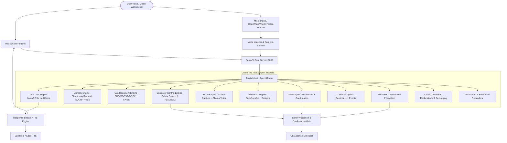

# JARVIS — Master Integration Plan & Specification
**Lead Integration Engineer & Architecture Document**  
**Developer & Owner**: Vamshi Krishna  
**Project Root**: `C:\Jarvis`  
**Git Remote**: `https://github.com/vamshibusiness/AI.git`  
**Target Hardware**: Windows 11, Intel Core i5-13420H, 16 GB RAM, NVIDIA GeForce RTX 3050 Laptop GPU (4 GB VRAM)  
**Primary Models**: `llama3.2:3b` via Ollama, `all-MiniLM-L6-v2` via FAISS/SentenceTransformers, `faster-whisper` (base/small), `edge-tts` (en-GB-ThomasNeural)  

---

## 1. Executive Summary & Core Directives
1. **JARVIS Sovereignty**: JARVIS is the primary identity, application, and codebase. External repositories in `C:\Jarvis\integrations\` are reference sources only.
2. **Zero Destructive Merges**: No working JARVIS functionality will be deleted, broken, or blindly replaced.
3. **Local-First & Resource-Constrained**: All operations are optimized for 4 GB VRAM. Large models (>4B) are never auto-loaded into continuous VRAM.
4. **Strict Security Model**: Unrestricted shell execution (`cmd`, `powershell`, `bash`), arbitrary `eval`/`exec`, and unconfirmed destructive actions (file deletion, email sending, system shutdown) are strictly prohibited.
5. **Clean Licensing & Attribution**: Permissive licenses (MIT, Apache 2.0) are incorporated with attribution; non-commercial / copyleft repos (AdvancedJarvis, Agent Zero) are adapted clean-room without copying code.

---

## 2. Target Modular Architecture

---

## 3. Feature Source Analysis & Integration Matrix

### Feature 1: Advanced Computer Control & Window Management
- **Source Repository**: `win-computer-use` / `WindowsComputerUse` & `WindowsJarvis`
- **Upstream License**: MIT (CarlosShao, Jarvis Contributors)
- **Source Files**:
  - `win_computer_use/window_mgmt.py`
  - `win_computer_use/input_control.py`
  - `win_computer_use/safety.py`
  - `win_computer_use/screen.py`
  - `WindowsJarvis/jarvis/tools/local/type_into_active_window.py`
  - `WindowsJarvis/jarvis/tools/local/system_stats.py`
- **Functionality Provided**:
  - Window enumeration, window focus/activation, minimizing, maximizing, restoring, closing by title.
  - Safe mouse movement clamped strictly within active monitor boundaries.
  - Safe keyboard keystroke injection into the active window.
  - Hardware system statistics (CPU load, RAM consumption, GPU VRAM status, battery).
- **Dependencies**: `pyautogui`, `pygetwindow`, `psutil`, `pillow` (already installed in `.venv`).
- **Compatibility**: High. Complements JARVIS's existing `backend/modules/computer/` structure.
- **Conflicts**: Raw mouse coordinate jumping without bounds checking could trigger unintended clicks.
- **Security Risks**: Malicious keystroke injection, closing critical applications.
- **Recommended Integration**:
  - Integrate into `backend/modules/computer/` (`controller.py`, `window_mgmt.py`, `safety.py`, `keyboard.py`, `mouse.py`, `system_stats.py`).
  - Maintain `safety.py` strict allow-lists and confirmation checks for app closes or system state changes.

---

### Feature 2: PDF & Multi-Document RAG with Citation Tracking
- **Source Repository**: `PDF-RAG` (`rag-ollama`), `RAG-FromScratch`, `ChatPDF`
- **Upstream License**: MIT
- **Source Files**:
  - `PDF-RAG/helpers/indexer.py`, `docs_db_handler.py`
  - `RAG-FromScratch/services/ingestion_service.py`, `services/query_service.py`
  - `ChatPDF/rag.py`
- **Functionality Provided**:
  - Ingestion of PDF, Markdown, TXT, DOCX files.
  - Document deduplication via content/SHA-256 hash checks to prevent redundant indexing.
  - Recursive character text chunking with overlapping windows.
  - SentenceTransformers (`all-MiniLM-L6-v2`) embeddings + FAISS vector indexing.
  - Semantic retrieval with minimum similarity threshold filtering.
  - Ollama answer generation with page numbers, document names, and chunk citation links.
  - FastAPI endpoints for document upload, index status, and query.
- **Dependencies**: `sentence-transformers`, `faiss-cpu` (already installed), `pypdf` (lightweight pure-Python PDF reader).
- **Compatibility**: Perfect match with existing `backend/modules/rag/` engine.
- **Conflicts**: Duplicate FAISS stores. (Solution: Keep a unified index store with document-level tagging).
- **Security Risks**: Ingestion of huge files causing out-of-memory errors; reading unauthorized system files.
- **Recommended Integration**:
  - Extend existing `backend/modules/rag/` (`rag_store.py`, `build_index.py`, `retriever.py`, `rag_answer.py`) to support PDF/multi-doc ingestion.
  - Add REST endpoints in `backend/main.py` (`/rag/upload`, `/rag/documents`, `/rag/query`).

---

### Feature 3: Robust Multi-Tier Memory (Short-Term, Long-Term, Semantic)
- **Source Repository**: `AdvancedJarvis` (conceptual), `OfflineJarvis`, existing JARVIS
- **Upstream License**: Custom Non-Commercial (AdvancedJarvis - clean-room adapted), Apache 2.0 (OfflineJarvis)
- **Source Files**:
  - `AdvancedJarvis/src/jarvis/memory/db.py`, `recall_gate.py`
  - `OfflineJarvis/collections/`
  - `backend/modules/llm/memory_manager.py`
- **Functionality Provided**:
  - **Short-Term Memory**: Real-time sliding window of current conversation turns.
  - **Long-Term Memory**: Curated user facts, preferences, project details persisted in SQLite / JSON.
  - **Semantic Memory**: Vectorized memories enabling contextual recall when relevant topics emerge.
  - **Privacy Redactor**: Auto-filters API keys, passwords, bearer tokens, OAuth secrets before saving to disk.
  - Explicit user memory commands: "Remember that...", "What do you know about my...", "Forget that...".
- **Dependencies**: Built-in `sqlite3`, `re`, `json`, existing `sentence-transformers` & `faiss`.
- **Compatibility**: Seamlessly enhances existing `memory_manager.py`.
- **Conflicts**: Inconsistent model names (`gemma4:e4b` vs `llama3.2:3b`).
- **Security Risks**: Accidental persistence of credentials or sensitive personal information.
- **Recommended Integration**:
  - Adapt into unified `backend/modules/memory/` with SQLite + semantic search and redactor filter.

---

### Feature 4: Screen Vision & OCR
- **Source Repository**: `win-computer-use` & `WindowsJarvis`
- **Upstream License**: MIT
- **Source Files**:
  - `win_computer_use/winocr.py`, `ocr.py`, `screen.py`
  - `WindowsJarvis/jarvis/tools/local/see_screen.py`
- **Functionality Provided**:
  - High-DPI screenshot capture saved temporarily to disk.
  - Windows Native OCR (via Windows.Media.Ocr / WinRT) with fallback to regex/layout extraction.
  - Screen vision query via Ollama (e.g. `llava-phi3` or configurable vision model) on demand without keeping heavy vision weights in VRAM continuously.
- **Dependencies**: `Pillow` (installed). Windows native OCR requires no additional heavy packages.
- **Compatibility**: High. Exposes `/vision/screen` and intent routing for "what's on my screen".
- **Conflicts**: GPU VRAM exhaustion if a 7B vision model is kept loaded.
- **Security Risks**: Screen content leakage if sensitive windows (banking, password managers) are captured without user request.
- **Recommended Integration**:
  - On-demand execution with auto-unload (`keep_alive: 0`) for vision models.
  - Save captures to temporary secure paths.

---

### Feature 5: Voice Pipeline Improvements (Barge-In, VAD, Stop Detection)
- **Source Repository**: `WindowsJarvis`, existing JARVIS voice pipeline
- **Upstream License**: MIT
- **Source Files**:
  - `WindowsJarvis/jarvis/audio/pipeline.py`, `vad.py`
  - `backend/modules/wakeword/listener.py`, `backend/modules/voice/tts.py`
- **Functionality Provided**:
  - Immediate interruption / barge-in when user utters stop words ("stop", "cancel", "quiet", "jarvis shut up").
  - Clear audio queue flushing in `tts.py` upon interruption.
  - Voice state synchronization (`idle`, `listening`, `thinking`, `speaking`) via WebSocket.
- **Dependencies**: `openwakeword`, `faster-whisper`, `edge-tts`, `pygame`, `sounddevice` (all already installed).
- **Compatibility**: Directly augments `backend/modules/wakeword/listener.py` and `tts.py`.
- **Conflicts**: Audio device contention between mic recording and speaker playback.
- **Security Risks**: None.
- **Recommended Integration**:
  - Add thread-safe stop event to `tts.py` and fast interrupt word detector in listener loop.

---

### Feature 6: Web Research & Verification
- **Source Repository**: Existing JARVIS `ResearchAgent` + `ARIA` search patterns
- **Upstream License**: MIT
- **Source Files**:
  - `backend/modules/agents/research_agent.py`, `backend/modules/web/search_tool.py`
  - `ARIA/src/tools/web_search.py`
- **Functionality Provided**:
  - Multi-query DuckDuckGo search.
  - Webpage text extraction, summarization, and source URL collection.
  - Truthfulness guarantee: if internet access is down or queries yield no facts, JARVIS explicitly admits failure rather than hallucinating sources.
- **Dependencies**: `ddgs` (installed), `requests`, `lxml` (installed).
- **Compatibility**: High. Retains existing research cache and async background tasks.
- **Security Risks**: SSRF, hitting blocked/malicious URLs.
- **Recommended Integration**:
  - Keep existing `research_agent.py`, enhance citation extraction, enforce domain filtering and timeouts.

---

### Feature 7: Modern React/Vite Frontend (ChatGPT-Style UI)
- **Source Repository**: Existing JARVIS frontend + ChatPDF / ChatGPT design paradigms
- **Upstream License**: MIT
- **Source Files**:
  - `original_source/frontend/src/App.jsx`, `App.css`, `main.jsx`
- **Functionality Provided**:
  - ChatGPT-style two-pane layout: responsive dark sidebar + main conversation viewport.
  - Sidebar: "New Chat", past session list, status badge (idle, listening, thinking, speaking), live Gmail & Calendar counts.
  - Conversation View: User messages on right, JARVIS responses on left.
  - Markdown formatting with code syntax highlighting and copy-to-clipboard buttons.
  - RAG source accordion/card: shows document name, page number, and similarity score.
  - Document/PDF drag-and-drop upload bar.
  - Tool execution badges ("Searching web...", "Analyzing screen...", "Retrieving docs...").
  - LocalStorage session persistence (no Firebase needed).
- **Dependencies**: `react`, `react-dom`, `vite` (already in `package.json`).
- **Compatibility**: Native to JARVIS.
- **Security Risks**: XSS in rendered markdown (mitigated by sanitized markdown rendering).
- **Recommended Integration**:
  - Restore and enhance frontend source code directly into `c:\Jarvis\frontend\src\`.

---

## 4. Implementation Strategy & Step-by-Step Roadmap

| Phase | Component / Area | Key Actions | Verification Milestone |
| :--- | :--- | :--- | :--- |
| **Phase 1** | **Safety & Analysis** | Create `THIRD_PARTY_FEATURES.md` and `INTEGRATION_PLAN.md`. Preserve all existing source code. | User approval of integration plan. |
| **Phase 2** | **Central Tool Router** | Build unified `ToolRegistry` and `AgentRouter` allowing controlled tool execution without arbitrary command execution. | Router routes chat, weather, rag, computer, calendar, research. |
| **Phase 3** | **Memory System** | Unify short-term, long-term, and semantic memory with redaction filter for secrets. | Pass memory storage and recall tests without credential leaks. |
| **Phase 4** | **PDF & Document RAG** | Implement `pypdf` extractor, chunking with overlap, FAISS storage, source citation formatter, and FastAPI upload endpoint. | Upload test PDF, query specific section, verify citations and answer. |
| **Phase 5** | **Computer Control & Windows Automation** | Rebuild and extend `backend/modules/computer/` with safe app management, window focus/minimize/close, bounded mouse/typing, system stats, and confirmation gate for destructive actions. | Test launch notepad, system stats, verify blocked root rejection. |
| **Phase 6** | **Screen Vision & OCR** | Implement screen capture utility with downscaling, Windows native OCR, and on-demand Ollama vision handler. | Verify screenshot capture and text extraction. |
| **Phase 7** | **Voice Pipeline Enhancements** | Add barge-in / audio cancellation ("stop", "cancel") and clean queue flushing to `tts.py` and `listener.py`. | Test audio stop trigger stops speech playback immediately. |
| **Phase 8** | **Gmail & Calendar Confirmation Safety** | Verify Google integration, enforce explicit user confirmation before email sending. | Verify mock/real email preparation requires confirm token. |
| **Phase 9** | **Modern Frontend UI** | Construct ChatGPT-style responsive React interface in `frontend/src` with sidebar, sessions, markdown, file upload, citations, and status indicators. | `npm run build` succeeds; UI connects to `:8000/ws`. |
| **Phase 10** | **End-to-End Automated Test Suite** | Implement and run tests in `backend/tests/` covering startup, chat, RAG, memory, computer control safety, and websocket. | All tests pass. Clean git status. |

---

## 5. Security & Resource Safeguards Checklist
- [x] **No arbitrary shell execution**: No unrestricted `subprocess.Popen("cmd")` or `powershell` execution by LLM.
- [x] **Safe Filesystem Roots**: Writes allowed only to `~/Desktop`, `~/Documents`, `~/Downloads`, `~/Pictures`, `~/Videos`. `C:/Windows`, `C:/Program Files`, and `.env` are blocked.
- [x] **Credential Protection**: `.env`, `google_credentials.json`, `token.json` are excluded from memory, RAG, and git.
- [x] **Low VRAM Guarantee**: Embedding model is CPU-friendly (`all-MiniLM-L6-v2`), primary LLM is `llama3.2:3b`, heavy research/vision models are unloaded after use.
- [x] **Failsafe Computer Control**: Emergency abort on corner hover or stop command.
